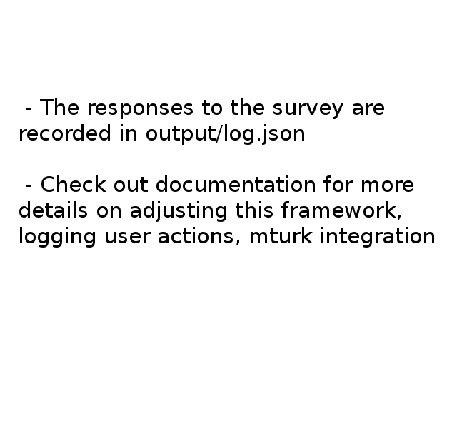

# Survey Framework

##Run the interactive demo

  1. navigate to survey_framework directory
  2. run python servers/buttonserver.py
  3. in the browser, go to localhost:2222/index.html

##Getting Started

####Modifying the content
Example: this json-type block goes from python to javascript to provide the new content
```python
#servers/buttonserver.py

if sessionData["picCount"]==3:
  ret = {"imageURL": "images/slide3.png",
         "buttonLabels": ["Prev", "Next"],
         "instructionText": "Slide 3",
         "sessionData": sessionData}
  return json.dumps(ret)
```
buttonoptions.js deals with this returned json.


####Moving to an html with a different layout
If a different page layout is needed, your server-side can include a flag in jsonData to notify the javascript. The following code is used to switch to a different page:
```javascript
//js/buttonoptions.js

if ("toSurvey" in jsonData){
  window.location.href = "survey.html";
}
```
The new html file can have it's own different content, styles, and script. In our example, as the experiment is over we load a questionnaire-page which features a new javascript to handle the inputs.


####Handling your custom html
In our example, survey.html - a page with a different format - posts to '/submit_survey' and we've prepared a handler ```@app.post('/submit_survey')``` in _buttonserver.py_
You could similarly write another post request handler for your custom buttons/pages


####Playing videos
This repository provides an example with playing a video. There is an empty hidden block for video in _index.html_:
```html
<video style="display:none;" id="ui-video" height="400" autoplay="autoplay" src=""></video>
```
To play a video in _index.html_ you need to add a videoURL and set ```sessionData["playVideo"]=1```
```python
#servers/buttonserver.py

if sessionData["picCount"]==4:  
  sessionData["playVideo"] = 1
  videoLink="videos/120to140.mp4"
  ret = {"videoURL": videoLink,
         "imageURL": "images/slide4.png",
         "buttonLabels": ['Prev', 'Next'],
         "instructionText": "Notice disabled buttons",
         "sessionData": sessionData}
  return json.dumps(ret)
```
In this example, we play the video, and display an image instead as soon as it's over. You can modify that behavior in _js/buttonoptions.js_


####Identifying the users
Generate an id for the client and keep it in their cookies:
```python
#servers/buttonserver.py

gen_id = ''.join(random.choice(string.ascii_uppercase +
  string.digits) for _ in range(6))
response.set_cookie('mturk_id', gen_id, max_age=survey_duration, path='/')
```
Retrieve the cookie to identify the user:
```python
#servers/buttonserver.py

mturk_id = request.cookies.get('mturk_id','NOT SET')
```


####Logging user actions
buttonserver.py keeps everything in the ``` data ``` dictionary: keys - user IDs, values - lists. 
Example: logging the time the user started the survey:
```python
#servers/buttonserver.py

startTime = datetime.datetime.now()
data[gen_id].append("start: "+ str(startTime))
```


####Saving the log
Currently done after the survey is finished.
```python
#servers/buttonserver.py

with open('output/log.json', 'w') as outfile:
    json.dump(data, outfile)
```


####An easy way to display mturk id after the survey is to just return a string in _buttonserver.py_. We provide an example with displaying a timestamp, but you could change it to mturk_id:
```python
return """
          <br><p>Fun fact: you started the demo at {}</p>
       """.format(startTime)
```


####A more advanced example
You can check out [buttonoptions](https://github.com/antonkuz/buttonoptions) repository for a more advanced example featuring a 1 user game adopted for study with multiple users running it at the same time