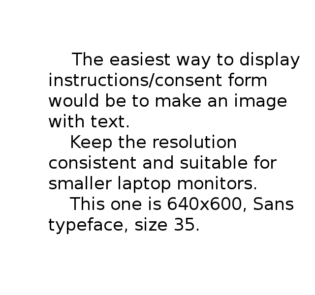

#Survey Framework

##Run the interactive demo

  1. navigate to survey_framework directory
  2. run python servers/buttonserver.py (don't cd into servers)
  3. in the browser, go to localhost:2222/index.html


##Modifying the slides

####Instructions, slide images, button labels
Example: this json-type block goes from python to javascript to provide the new content
```python
#servers/buttonserver.py

if sessionData["picCount"]==3:
  ret = {"imageURL": "images/slide3.png",
         "buttonLabels": ["Prev", "Next"],
         "instructionText": "Slide 3",
         "sessionData": sessionData}
  return json.dumps(ret)
```
buttonoptions.js deals with this returned json.  


####Slides Layout
* To change the order, edit index.html
* To change button positioning, edit css/mystyle.css
Example: move instructions below the slides:
```html
<!-- index.html -->
<div class="container-fluid">
  <div id="screen">
    
    <video style="display:none;" id="ui-video" height="400" autoplay="autoplay" src="">
    </video>
  </div> 
  <!-- THIS LINE --> <h3 id="instruction-text"></h3> <!-- N0W UNDER THE IMG/VID -->
  <button id="left-button" type="button" class="ui-button btn btn-primary btn-lg" style="display:none;">null</button>
  <button id="right-button" type="button" class="ui-button btn btn-primary btn-lg">Next</button>
</div>
```


####Playing videos
This repository provides an example with playing a video. There is an empty hidden block for video in _index.html_:
```html
<video style="display:none;" id="ui-video" height="400" autoplay="autoplay" src=""></video>
```
To play a video in _index.html_ you need to add a videoURL and set ```sessionData["playVideo"]=1```
```python
#servers/buttonserver.py

if sessionData["picCount"]==4:  
  sessionData["playVideo"] = 1
  videoLink="videos/120to140.mp4"
  ret = {"videoURL": videoLink,
         "imageURL": "images/slide4.png",
         "buttonLabels": ['Prev', 'Next'],
         "instructionText": "Notice disabled buttons",
         "sessionData": sessionData}
  return json.dumps(ret)
```
In this example, we play the video, and display an image instead as soon as it's over. You can modify that behavior in _js/buttonoptions.js_  


##Setting up a questionnaire or any significantly different layout

We will explain this on the example of the questionnaire that's featured in the demo.  


####Moving from slides to questionnaire
If a different page layout is needed, your server-side can include a flag in jsonData to notify the javascript. The following code is used to switch to a different page:
```javascript
//js/buttonoptions.js

if ("toSurvey" in jsonData){
  window.location.href = "survey.html";
}
```


####Connecting the survey page with the server
If you're setting up your own html file, the following is required to connect it to the server:
* post request sending in your html file (forms) or javascript (buttons)
* post request handling in _buttonserver.py_  
  
Questionnaire example:
```html
<!-- survey.html -->
<form action="submit_survey" method="post" id="survey">
  <!-- ^ Note the action and method -->
  [...]
</form>
```
```python
#buttonserver.py
@app.post('/submit_survey')
def handle_survey():
```  

Button handling example:
```javascript
//buttonoptions.js
$.post(buttonPOSTUrl, JSON.stringify(postData), handleResponse);
```
```python
#buttonserver.py
@app.post('/ui/button')
def do_click():
```  


##Integrating your python experiment script
Check out our [buttonoptions](https://github.com/antonkuz/buttonoptions) repository for a more advanced example featuring a 1 user game adopted for study with multiple users running it at the same time.
Main adjustments to add our python modules:
* Model2.py in servers directory
* import Model2 in buttonserver.py
* we call Model2 functions passing button index and some indices and get output to determine the new page content

##Collecting the data

####Logging user actions
buttonserver.py keeps everything in the ``` data ``` dictionary: keys - user IDs, values - lists. 
Example: logging the time the user started the survey:
```python
#servers/buttonserver.py

startTime = datetime.datetime.now()
data[gen_id].append("start: "+ str(startTime))
```


####Saving the log
Currently done after the survey is finished.
```python
#servers/buttonserver.py

with open('output/log.json', 'w') as outfile:
    json.dump(data, outfile)
```


##Mturk related

####Identifying the users
Generate an id for the client and keep it in their cookies:
```python
#servers/buttonserver.py

gen_id = ''.join(random.choice(string.ascii_uppercase +
  string.digits) for _ in range(6))
response.set_cookie('mturk_id', gen_id, max_age=survey_duration, path='/')
```
Retrieve the cookie to identify the user:
```python
#servers/buttonserver.py

mturk_id = request.cookies.get('mturk_id','NOT SET')
```

####An easy way to display mturk id after the survey is to just return a string in _buttonserver.py_. We provide an example with displaying a timestamp, but you could change it to mturk_id:
```python
return """
          <br><p>Fun fact: you started the demo at {}</p>
       """.format(startTime)
```